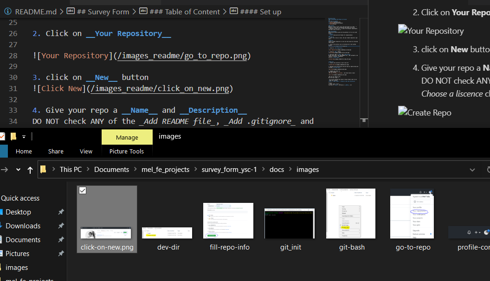

## Yes SheCodes without STEM Survey Form
#### FreeCodeCamp web design curriculum  
🔹🔹🔹🔹🔹🔹🔹🔹🔹🔹🔹🔹🔹🔹🔹🔹🔹🔹🔹🔹🔹🔹🔹🔹🔹🔹🔹🔹🔹🔹🔹🔹🔹🔹🔹🔹🔹🔹🔹

### Table of Content 
* [Context](#general-info)
* [Technologies](#technologies)
* [Setup](#setup)

---

### Context
Because I like to color 🌈 my life with some css on html,  I decided to follow the freecodecamp web design curriculum.   
___Buiding a survey form___ is one of the project requirements and that's why I'm here 😊. 

### Technologies
Mastering the basics gives me the potential to fly 🕊️so I used plain: 
- **html**
- **css** (Grid and Flexbox for responsiveness)

#### Set up 
⚠️ _Don't do it only in local. Set your remote repository righ away!_

**STEP I**  
Create an empty repository in your github account by following these steps: 

1. Click on the profile icon in the menu bar of your github account 
